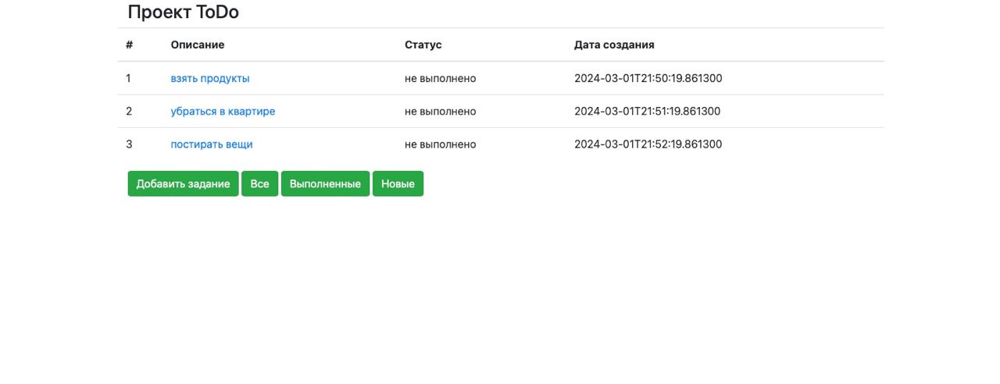
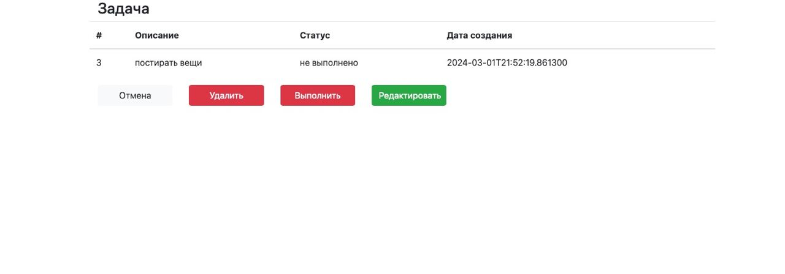

# job4j_todo

## О проекте

Сайт поможет вести задачи, выставлять статусы, следть за сроками.

- Вывод списка задач;
- Добавление.
- Редактирование.
- Удаление.
- Изменение статуса.

## Требования к окружению

- PostgreSQL 
- Maven
- JDK 17

## Запуск

1. Клонируйте репозиторий проекта с GitHub: https://github.com/maulenzhar/job4j_todo.git
2. Перейдите в директорию проекта: cd job4j_todo
3. Соберите проект с помощью Maven: mvn clean install
4. Запустите приложение

## Используемые технологии

1. Spring Boot
1. Hibernate
1. Lombok
1. Thymeleaf

## Контакты

Мой телеграмм: [mnzhar](@mnzhar).  
